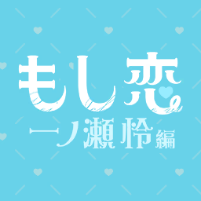

# Idoly Pride 个人汉化合集

- 译者: 天与秋怜 NRZSUZBB
- 单推: 一之濑怜

## 一之濑怜角色卡剧情

|登场时间|卡名|类型|获得方式|文本|
|:-:|---|:-:|---|---|
|——|高台をかける薫風|5★蓝轨辅助|——|
|——|密かなお楽しみ|4★蓝轨得分|——|
|——|夜の自主トレ|3★蓝轨支援|——|
|2021.09.21~2021.09.28 【熱帯びる狂踏】(通常)|失敗なんて恐れない|5★黄轨得分||
|2021.10.31~2021.11.10|ココロ Distance|2★蓝轨辅助|合宿活动赠送|
|2022.01.03~2022.01.20 【Sunny New Year】(限定)|絶対秘密のバックステージ|5★黄轨辅助||
|2022.04.20~2022.04.30 【追懐の零れ桜】(通常)|花あかり誘う笑顔|5★黄轨支援|2023.01.03~2023.01.20 复刻|√
|2022.07.03~2022.07.20 【夏は弾けて】(限定)|大胆なのは夏のせい|5★红轨辅助|2023.01.24~2023.02.09 P池复刻   2023.05.17~2023.05.24 P池复刻|√
|2022.10.24~2022.11.24|单马尾发型|——|高级限定卡池 (5★麻奈复刻)|
|2022.12.27~2023.01.03 【アイプラフェス】(限定)|踊る彼女に息をのむ|5★蓝轨辅助|FES 限定卡池|√
|2023.05.14~2023.05.27 【もしも君と恋をしたら】(通常)|もしも君の手に触れたら|5★红轨得分|若恋通常卡池|√
|2023.08.29~2023.09.15 【ときめきファンシーポップ】(限定)|ステップアップ・バンビーナ|5★蓝轨得分||√
|2023.11.28~2023.12.12 【君と輝くサンシャイン!!】|サンシャイン！！|2★红轨辅助|联动活动赠送|
|2024.03.08~2024.03.15 【わくわく遊園地バースデー】(限定)|わくわく遊園地バースデー(附双马尾发型)|5★红轨支援|生日限定卡池|
|2024.03.11~2024.03.27 【繋ぐ、みんなの想い】(通常)|ダンシングキューピッド|5★蓝轨支援||
|2024.05.24~2024.06.24 【勝利のピース！】(限定)|勝利のピース！|5★红轨支援|高级限定卡池|
|2024.07.08~2024.07.22 【真夏のウキドキサバイバル！】(限定)|時止まる常夏|5★红轨辅助||
|2024.09.25~2024.10.03 【アイプラフェス】(限定)|故郷の海にほころんで|5★黄轨得分|FES 限定卡池|

## もしも君と恋をしたら (若与你相恋)

简称：若恋/もし恋/MoshiKoi

|时间|角色|文本|
|:-:|---|---|
|2023.05.14~2023.05.27||[原文](MoshiKoi/2023.05.14_IchiNoSe_Rei/Script.md)|
|2023.11.14~2023.11.27||[原文](MoshiKoi/2023.11.14_IBuki_Nagisa/Script.md)|
|2023.12.15~2023.12.25|一之濑怜|复刻|
|2024.05.17~2024.05.31||[原文](MoshiKoi/2024.05.17_HayaSaka_Mei/Script.md) [译文](MoshiKoi/2024.05.17_HayaSaka_Mei/Script_Translated.md)|
|2024.06.04~2024.06.16|伊吹渚|复刻|
|2024.11.14~2024.11.27||[原文](MoshiKoi/2024.11.14_SuzuMura_Yu/Script.md)|
|2024.12.10~2024.12.23|早坂芽衣|复刻|