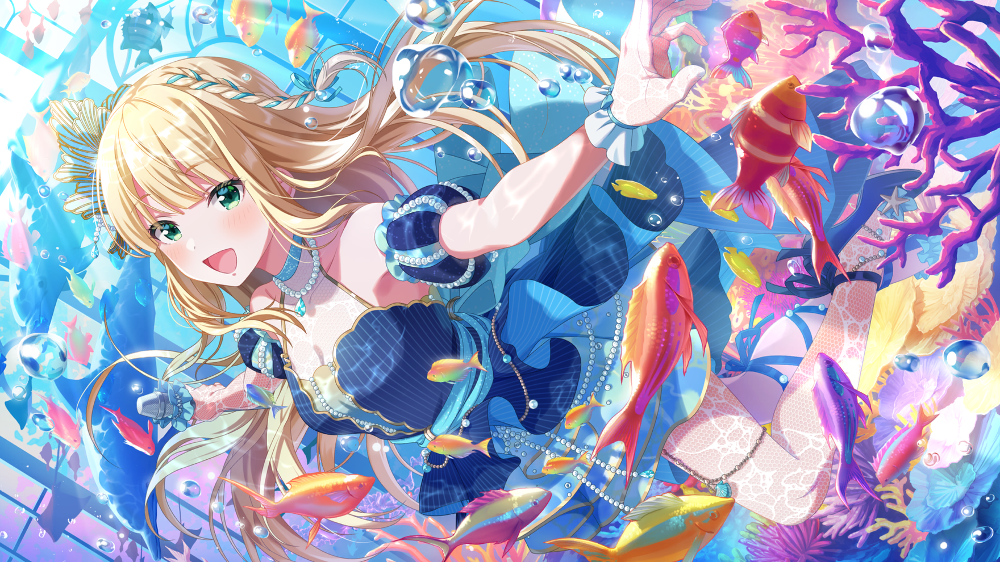

# 故郷の海にほころんで: 于故乡的海中绽放

## 第一话 どういたしまして: 不用谢

|角色|原文|译文|
|---|---|---|
|一ノ瀬怜|お疲れ様。みんな、この後は別の仕事があるのよね|
|一ノ瀬怜|大変だと思うけど頑張ってね。それじゃ、また後で|
|一ノ瀬怜|ふぅ……今日のステージは、イメージ通りに出来た|
|一ノ瀬怜|月ストとの里帰りライブに向けての準備も順調|
|一ノ瀬怜|これもスタッフのみなさんが支えてくれるおかげよね|
|一ノ瀬怜|特に、マネジャーさんには感謝しないと|
|一ノ瀬怜|今日はこの後オフだし、そろそろ帰ろうっと|
|一ノ瀬怜|って……あれ、マネジャーさん？|
|マネジャー|まいったな、スケジュール的に絶対無理だが……|
|マネジャー|星見市での久しぶりのライブだし無下に断る訳にも……|
|一ノ瀬怜|どうしたんですか？|
|マネジャー|うわっ！？　な、なんだ怜か。驚いた|
|マネジャー|今日のステージ、凄く良かったよ。お疲れ様|
|一ノ瀬怜|ありがとうございます。……じゃなくて|
|一ノ瀬怜|何を悩んでるんですか？　口から悩みがもれてましたよ|
|マネジャー|なんでもないよ|
|一ノ瀬怜|なんでもなくはないですよね。まいったな、って|
|一ノ瀬怜|言ってたじゃないですか。ため息までついて|
|マネジャー|いや、大したことじゃないんだ。俺の仕事のことだし|
|マネジャー|気にしないで、早く帰って休んでくれ。疲れてるだろ？|
|一ノ瀬怜|嫌です、帰りません。大体、前からみんなに言われて|
|一ノ瀬怜|ますよね？　なんでも一人で抱え込み過ぎだって|
|一ノ瀬怜|それとも、私じゃ頼りなくて相談出来ませんか|
|一ノ瀬怜|あぁ、そうですか。そういうことですか|
|マネジャー|お、落ち着いてくれ、怜。声が大き過ぎる|
|マネジャー|変に注目されてるから。それこそ覗き魔の時くらい……|
|一ノ瀬怜|覗き魔……あぁ、私がマネジャーさんを|
|一ノ瀬怜|覗き魔だと思って、大声で通報しようとした時……|
|一ノ瀬怜|……って、そんな昔の話持ち出さないで下さい！|
|一ノ瀬怜|そもそも誰のせいで大声出してると思ってるんですか！|
|マネジャー|す、すまない、俺が悪かった……でも静かにしてくれ|
|マネジャー|ほら、周りの人が、俺達を遠巻きに見てるから……|
|一ノ瀬怜|うっ、すみません。……ならサニピの楽屋に来て下さい|
|一ノ瀬怜|他のみんなはもう先に出ちゃって、空いてますから|
|マネジャー|あぁ、分かった。こうなったら、ちゃんと話すよ|
|マネジャー|怜だって気になるだろうしな|
|一ノ瀬怜|まったくです|
|一ノ瀬怜|最初から素直に話してくれれば良かったのに|
|一ノ瀬怜|今度のライブの打ち合わせ、ですか？|
|マネジャー|あぁ、星見市への里帰りライブがもうすぐだろう|
|マネジャー|そのことで、ちょっとな|
|一ノ瀬怜|市内の人気テーマパークでやるんですよね|
|一ノ瀬怜|私達も、月ストのみんなも凄く楽しみにしています|
|一ノ瀬怜|それに、星見市は私達の故郷で、始まりの場所ですから|
|一ノ瀬怜|今回もいいライブにしようってみんな燃えてるんです|
|マネジャー|頼もしいな。期待してるよ|
|マネジャー|ただ、そのライブの構成が悩みどころなんだ|
|マネジャー|前回の里帰りライブの時と同じく|
|マネジャー|今回もイルカショーをやろうっていう話が出ていてな|
|一ノ瀬怜|イルカショー……！　楽しそうでいいじゃないですか|
|一ノ瀬怜|みんなも喜ぶと思います|
|マネジャー|ただ、前回は月ストとサニピで分かれてライブをしたが|
|マネジャー|今回は二グループ十人が一緒にステージに立つだろ？|
|マネジャー|立ち位置も変えないといけないし、イルカショーも|
|マネジャー|やるとなると、段取りが複雑になりそうなんだ|
|マネジャー|だから今度の打ち合わせで、可能なら出演者の……|
|マネジャー|怜達の意見も直接聞きたい、って頼まれて……|
|一ノ瀬怜|話は分かりました|
|一ノ瀬怜|つまり、誰か同行すればいいってことですよね|
|マネジャー|そうなんだが……打ち合わせの日にちが明日なんだよ|
|一ノ瀬怜|えっ、明日！？　随分急ですね|
|マネジャー|あぁ。サニピも月ストも今やBIG4だからな|
|マネジャー|急に明日のスケジュールなんて取れないんだよ|
|一ノ瀬怜|それはそうですよね|
|一ノ瀬怜|レギュラー番組も増えて、みんな忙しいですし……|
|一ノ瀬怜|あら？　でも……。あの、マネジャーさん|
|一ノ瀬怜|その打ち合わせって、明日の何時からですか？|
|マネジャー|午後三時からだけど？|
|一ノ瀬怜|それなら私、ぎりぎり間に合います|
|一ノ瀬怜|私が会議に参加しますよ|
|一ノ瀬怜|明日は、お昼までラジオの収録がありますけど|
|一ノ瀬怜|その後は、実家に半日帰省するつもりだったんです|
|一ノ瀬怜|実家に戻る時間を少し遅くすれば、参加出来ますから|
|一ノ瀬怜|いいステージにするためにも、ぜひ参加させて下さい|
|マネジャー|でも忙しいんだから、こういう機会でもないと|
|マネジャー|ご家族とゆっくり過ごせないだろ。さすがに悪いよ|
|一ノ瀬怜|別に会えなくなる訳じゃありませんし|
|一ノ瀬怜|里帰りライブは、絶対に成功させたいじゃないですか|
|一ノ瀬怜|いいですよね？　マネジャーさん|
|マネジャー|分かった。それじゃあ明日は、怜に参加してもらうよ|
|マネジャー|すまないな|
|一ノ瀬怜|すまない、って。なんで謝るんですか|
|一ノ瀬怜|別に謝られるようなことされてません|
|マネジャー|そうだな。すまない、ついクセで……じゃなくて……|
|マネジャー|ありがとう、助かるよ、怜|
|一ノ瀬怜|最初っから素直に言えばいいんです|
|一ノ瀬怜|ふふ、どういたしまして|

## 第二话 一度懲らしめておかないと: 如果不惩罚一下的话

|角色|原文|译文|
|---|---|---|
|マネジャー|本日はありがとうございました|
|マネジャー|詳細はまた後日、ご連絡させていただきます|
|一ノ瀬怜|失礼します。引き続き、よろしくお願いします|
|一ノ瀬怜|……ふぅ、なんとかまとまりそうで良かったですね|
|マネジャー|あぁ。でも思った以上に、注意事項が多かったな……|
|マネジャー|怜に来てもらって正解だったよ|
|一ノ瀬怜|私も来て良かったです|
|一ノ瀬怜|おかげで、より良いステージに出来そうですから|
|マネジャー|本当にありがとう、今日は助かったよ|
|マネジャー|遅くなったけど、早く実家の方に帰ってあげてくれ|
|一ノ瀬怜|マネジャーさんはこの後どうするんですか？|
|マネジャー|せっかく星見市に来たし、以前お世話になった人達に|
|マネジャー|挨拶回りをしていこうと思ってるけど|
|一ノ瀬怜|それなら一緒に行きます|
|一ノ瀬怜|私もご挨拶したい人達がいるんです|
|一ノ瀬怜|家族とは、普段から電話とかでやりとりしてますし|
|一ノ瀬怜|こういう機会じゃないと挨拶出来ない人達もいますから|
|マネジャー|(やけに乗り気だけど……なるほどな。怜にとっても)|
|マネジャー|(お世話になった人達にお礼を伝えるいい機会って訳か)|
|一ノ瀬怜|何ニヤニヤしてるんですか？　置いてっちゃいますよ|
|一ノ瀬怜|出来るだけ、沢山回りたいんですから|
|一ノ瀬怜|店長、ご無沙汰してます|
|一ノ瀬怜|アルバイトしてた頃は本当にお世話になりました|
|一ノ瀬怜|デビューした後も、私達のポスターを貼り出して|
|一ノ瀬怜|くれて。呼び込みのお仕事までいただいてしまって|
|一ノ瀬怜|あ、これ今度のライブのチケットです|
|一ノ瀬怜|良かったら観に来て下さい|
|マネジャー|(怜も店員さん達も、久しぶりに会えたからだろう)|
|マネジャー|(凄く嬉しそうだ。随分話が盛り上がってるな)|
|一ノ瀬怜|特売の日は、つい張り切って大声出しちゃってました|
|一ノ瀬怜|ふふ、肺活量のいいトレーニングになってた気がします|
|一ノ瀬怜|え？　この前また、オトクオトクが聞けて嬉しかった？|
|一ノ瀬怜|ぜ、全国ツアーのDVD特典映像、観たんですか！？|
|マネジャー|それでは、名残惜しいですがこの辺で|
|マネジャー|怜、そろそろ行こう|
|一ノ瀬怜|はい、マネジャーさん|
|一ノ瀬怜|……それじゃあ、また遊びに来ますね！|
|一ノ瀬怜|思ってたより遅くなっちゃいましたね|
|一ノ瀬怜|みんな優しくて、つい話し込んじゃいました|
|一ノ瀬怜|星見市って、やっぱりいい街ですよね|
|一ノ瀬怜|地元びいきかもしれませんけど、大好きです|
|マネジャー|俺もだ。みんなの始まりの場所だしな。そういえば|
|マネジャー|怜が星見プロに入りたいと言ったのも、ここだったな|
|一ノ瀬怜|ここに入ることは出来ますか？|
|一ノ瀬怜|ええ。それを仕事として、職業として|
|一ノ瀬怜|両親に紹介出来るのであれば、私は構いません|
|マネジャー|あの時は、突然だったから驚いたよ|
|一ノ瀬怜|あはは、すみません……。あの頃は両親から離れて|
|一ノ瀬怜|なんとか一人でやっていこうと必死で……|
|一ノ瀬怜|でも、あの時に、この場所で決めたことを|
|一ノ瀬怜|後悔したことはありません|
|マネジャー|そうだ、ご両親といえば、怜のご家族に送るチケットは|
|マネジャー|三枚でいいか？　ご両親と、お兄さんの分|
|一ノ瀬怜|あ、いえ、兄は客席で観るのが好きなので|
|一ノ瀬怜|いつも通り二枚で――|
|一ノ瀬怜|……って、あれ？　なんで急に兄の分も|
|一ノ瀬怜|用意してくれたんですか？　今まで言ってなかったのに|
|マネジャー|すずから聞いたんだ。怜はお兄さんが大好きだって|
|マネジャー|なら、ライブにも来てもらった方がいいんじゃないかと|
|一ノ瀬怜|と、特別好きとかじゃありませんから！|
|一ノ瀬怜|普通です。ごく普通の兄妹です！|
|マネジャー|そうなのか？　「いつも凄く楽しそうに電話してます|
|マネジャー|わよ。もうデレデレなくらいで」って言ってたぞ？|
|一ノ瀬怜|すずが誇張して言ってるだけです！|
|一ノ瀬怜|寮に戻ったら、一度懲らしめておかないと……|
|マネジャー|……あまり厳しくしないであげてくれよ。それじゃ|
|マネジャー|怜の家族のチケット二枚、明日にでも手配しておくよ|
|一ノ瀬怜|そうですね。二枚……あ、でも……|
|マネジャー|浮かない顔だけど、どうしたんだ？|
|マネジャー|心配ごとでもあるのか？|
|一ノ瀬怜|……父は、その日仕事が入っているらしくて|
|一ノ瀬怜|来れるか分からなくて|
|マネジャー|そうか……怜のお父さんはお医者さんだったな|
|マネジャー|ライブに合わせて仕事を休むのは難しいよな|
|一ノ瀬怜|急な手術が入ることもあるし、仕方ありませんよ|
|一ノ瀬怜|だからチケット、一枚無駄にしちゃったらすみません|
|マネジャー|(……これはご家族の問題だ)|
|マネジャー|(俺に出来ることはないが……でも……)|

## 第三话 教えてもらいますからね： 也要告诉我噢

|角色|原文|译文|
|---|---|---|
|マネジャー|怜、全員で最後の確認をしたいから、集まって……|
|マネジャー|……どうした？　スマホをじっと見つめて|
|一ノ瀬怜|あ、いえ、大したことじゃありません|
|一ノ瀬怜|母からメッセージが来ただけです|
|一ノ瀬怜|父が、今日のライブを観に行くために|
|一ノ瀬怜|ギリギリまで予定を調整してくれていたらしくて|
|一ノ瀬怜|……でも、やっぱりダメだったそうです|
|一ノ瀬怜|今日のライブ、来れないって連絡が……|
|マネジャー|そうか……残念だったな|
|一ノ瀬怜|いえ、元々あまり期待はしていませんでしたから|
|一ノ瀬怜|気にしてませんよ|
|一ノ瀬怜|プライベートなことで時間をとらせてすみません|
|一ノ瀬怜|今、行きます――|
|一ノ瀬怜|……メッセ？　え……お父さんからだ……|
|一ノ瀬怜|「頑張れ」……|
|一ノ瀬怜|っ……お父さん……。来れないくらい忙しいのに|
|一ノ瀬怜|何やってるんだか……いつも返事もしないくせに……|
|一ノ瀬怜|……あれ、また届いた|
|一ノ瀬怜|「マネージャーさんによろしく伝えてくれ」……|
|一ノ瀬怜|……え？|
|一ノ瀬怜|マネジャーさん、父と何かあったんですか？|
|マネジャー|チケットを送る時に|
|マネジャー|メッセージを一筆、添えさせてもらっただけだよ|
|マネジャー|怜がこうして元気にアイドルを続けていられるのは|
|マネジャー|ご家族の理解と協力があってこそだ|
|マネジャー|だから、一言お礼と感謝の気持ちを伝えたいと思って|
|一ノ瀬怜|わざわざ、そんなことしてたんですか……！？|
|一ノ瀬怜|マネジャーさんってほんとおせっかいですね|
|一ノ瀬怜|お父さんもお父さんだわ|
|一ノ瀬怜|「頑張れ」、だなんて|
|一ノ瀬怜|マネジャーさんへのメッセージの方が|
|一ノ瀬怜|長いって、おかしくないですか？|
|マネジャー|照れくさいから、ぶっきらぼうになってるんだと思うぞ|
|マネジャー|そういうところ、怜に似てるんじゃないか？|
|マネジャー|怜もメッセージを受け取った時は|
|マネジャー|あんなに嬉しそうにしてたのになぁ|
|一ノ瀬怜|なっ……そ、そうですよ！　悪いですか！？|
|一ノ瀬怜|応援してもらえて、嬉しくない訳ないじゃないですか|
|マネジャー|別に悪くはないと思うぞ。良かったな、怜|
|マネジャー|……って、そろそろ行かないと。本番が始まりそうだ|
|一ノ瀬怜|はい、分かりました|
|一ノ瀬怜|おせっかいのお礼に、最高のステージを見せますから|
|一ノ瀬怜|(凄い……お客さんの声援が、こんなにも沢山……)|
|一ノ瀬怜|(初めて私達がライブをしたのも、この星見市だった)|
|一ノ瀬怜|(でもデビューしたての頃は、お客さんも少なくて……)|
|一ノ瀬怜|(でも、今は……)|
|一ノ瀬怜|(こんなにも大勢の人達が観に来てくれてる……)|
|一ノ瀬怜|(……伝えたい)|
|一ノ瀬怜|(ずっと応援してくれている人達、みんなに……)|
|一ノ瀬怜|(商店街の人、学校の友達)|
|一ノ瀬怜|(それにお母さんに、お兄ちゃん……)|
|一ノ瀬怜|(それから、今はお父さんにも……)|
|一ノ瀬怜|(ありがとうって気持ちを、歌に乗せて、届けたい)|
|マネジャー|さすが怜。有言実行だな。言ってた通り、最高だ|
|マネジャー|里帰りライブにふさわしい仕上がりだよ|
|一ノ瀬怜|みんな……！　私達を支えて、応援し続けてくれて|
|一ノ瀬怜|――本当に、ありがとう！|
|マネジャー|拝啓、秋涼の折、ますますご繁栄のことと|
|マネジャー|お慶び申しげます――|
|一ノ瀬怜|マネジャーさん、次の仕事の件ですけど|
|一ノ瀬怜|……誰に手紙を書いてるんですか？|
|マネジャー|里帰りライブの後、怜のお父さんから丁寧なお返事を|
|マネジャー|いただいたんだ。俺も返事を返さないと失礼だろう？|
|一ノ瀬怜|二人して、律儀というかなんというか……|
|一ノ瀬怜|そんなの、言ってくれれば私が伝えておくのに|
|マネジャー|じゃあ読んでみるか？|
|マネジャー|怜のことも心配してるみたいだぞ|
|一ノ瀬怜|よ、読みません！　お父さんってば|
|一ノ瀬怜|なんでそんな恥ずかしいこと書いてるのよ！|
|マネジャー|恥ずかしいことは書いてないって。じゃ、俺が読むよ|
|マネジャー|「娘は頑固なところがありますが、根は優しい子で」|
|一ノ瀬怜|音読しないで下さい！　あと頑固じゃありません！|
|一ノ瀬怜|お父さんの方が何倍も頑固なくせに、なんなのよもぉ|
|一ノ瀬怜|私へのメッセは短いのに、手紙はやけに長文だし……|
|一ノ瀬怜|マネジャーさん、その手紙返して下さい！|
|マネジャー|いや、俺宛にきたんだけど……|
|マネジャー|とりあえず、返事を書いちゃうから|
|一ノ瀬怜|それも、後で何を書いたか教えてもらいますからね！|
|一ノ瀬怜|はぁ……お父さんって、ほんと分かんないわね|